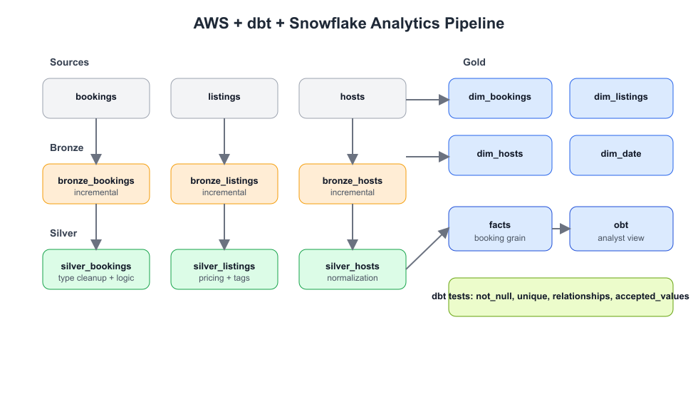

# AWS + dbt + Snowflake Analytics Engineering Portfolio Project

This repository showcases an end-to-end analytics engineering workflow using **dbt on Snowflake**.
The project models Airbnb-style booking data from raw sources to analytics-ready marts, with
incremental loading, SCD2 snapshots, reusable macros, and data quality tests.

## Project Goal

Build a production-style ELT project that demonstrates:
- clear medallion-style modeling (`bronze` -> `silver` -> `gold`)
- historical dimension tracking with dbt snapshots
- trustworthy analytics outputs with built-in data tests
- maintainable SQL transformation patterns with Jinja macros

## Tech Stack

- **Warehouse:** Snowflake
- **Transformation:** dbt Core
- **Language:** SQL + Jinja
- **Modeling pattern:** Bronze / Silver / Gold
- **Quality checks:** dbt tests (`not_null`, `unique`, `relationships`, `accepted_values`)

## Architecture Overview

<p align="center">
  
</p>

[Open architecture diagram](./aws_dbt_snowflake_architecture.png)

1. **Sources (`staging`)**
   - Raw tables: `bookings`, `listings`, `hosts`
2. **Bronze layer**
   - Incremental ingestion from source tables
3. **Silver layer**
   - Type cleanup and business logic enrichment (pricing, tags, host normalization)
4. **Gold layer**
   - `dim_date` conformed calendar dimension
   - SCD2 dimensions via snapshots (`dim_bookings`, `dim_listings`, `dim_hosts`)
   - `facts` booking-grain fact table with historical joins
   - `obt` one-big-table for analyst-friendly exploration

## What Makes This Portfolio Project Strong

- **Incremental patterns:** bronze and silver models use incremental materializations.
- **Historical correctness:** facts join to SCD snapshot versions using booking creation timestamps.
- **Business metrics included:** cancelled/completed booking counters and net booking value excluding cancellations.
- **Reusable macro design:** custom macros for tagging and numeric calculations reduce repeated SQL.
- **Data trust:** tests validate keys, dimensional relationships, and accepted status values.

## Repository Structure

```text
aws-dbt-snowflake/
  aws_dbt_snowflake_project/
    models/
      sources/
      bronze/
      silver/
      gold/
        ephemeral/
    snapshots/
    tests/
    macros/
    dbt_project.yml
    profiles.yml
```

## Key Models

- `models/gold/facts.sql`
  - Core fact table at booking grain
  - Adds cancellation logic and links to date/listing/host dimensions
- `models/gold/dim_date.sql`
  - Date dimension used for time intelligence in BI tools
- `models/gold/obt.sql`
  - Analyst-friendly denormalized table combining bookings, listings, and hosts
- `snapshots/*.yml`
  - SCD2 tracking for bookings, listings, and hosts using timestamp strategy

## How to Run Locally

From the repository root:

```zsh
export DBT_PROFILES_DIR="$PWD/aws_dbt_snowflake_project"
set -a
source aws_dbt_snowflake_project/.env
set +a
```

Then execute:

```zsh
dbt deps --project-dir aws_dbt_snowflake_project
dbt run --project-dir aws_dbt_snowflake_project
dbt test --project-dir aws_dbt_snowflake_project
dbt snapshot --project-dir aws_dbt_snowflake_project
```

Optional docs generation:

```zsh
dbt docs generate --project-dir aws_dbt_snowflake_project
dbt docs serve --project-dir aws_dbt_snowflake_project
```

## Example Analytics Questions This Model Supports

- What is total gross booking value by city and month?
- What share of bookings are cancelled over time?
- How do host performance tags correlate with booking value?
- How do listing attribute changes (captured via SCD snapshots) impact conversion and revenue?

## Skills Demonstrated

- Dimensional modeling for analytics
- SCD2 historical tracking in dbt
- Incremental data pipeline design
- Data quality and testing strategy
- Maintainable SQL architecture for collaboration and scale

